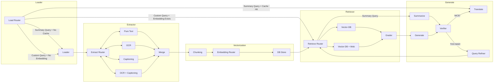

# LangGraph 구조 설명

## 전체 플로우차트

## 상세설명
- Loader Layer : pdf를 받아오는 레이어
	- Loader : 
		- file ID, link를 받아와 pdf 파일을 넘겨줌
- Extractor : pdf에서 텍스트를 출력하는 레이어
	- Extract Router : 
		- 판단 로직을 따르거나 llm에게 맡겨 어떤 기능으로 텍스트를 뽑아올지 결정
			- 판단 로직 :
				- 1. 기본적으로 OCR(ocr_page) 수행
				- 2. OCR에서 Error 발생시 Pure Text로 다시 수행
				- 3. Cationing은 현재 전부 미구현상태이므로 판단 로직 X
	- Pure Text : 
		- PyMuPDF를 이용해 텍스트 부분만 가져옴.
		- 다른 노드들과 달리 Error 발생시 노드 재수행이 아니라 Extract Router로 돌아감
	- OCR : 
		- PDF의 각 페이지별로 판단 로직을 거쳐 텍스트 부분만 가져올지, OCR로 텍스트를 추출할지 결정
			- 판단 로직 :
				- PyMuPDF를 통해 가져온 텍스트의 길이가 K(기본값 50)자가 넘지 않는다면 OCR 수행
			- 추출 후 검사
				- 추출된 텍스트가 정상적인 문맥 파악이 되는지 LLM으로 확인, 문맥 파악이 심각하게 불가능하다면 Error 처리
				- 모든 페이지에 대해 LLM을 처리하기엔 비용이 너무 크므로 처음 N(기본값 3)장만 처리
		- 다른 노드들과 달리 Error 발생시 노드 재수행이 아니라 Extract Router로 돌아감.
	- Captioning : 
		- pass
	- OCR + Captioning : 
		- pass
	- Merge : 
		- 가져온 텍스트들을 하나의 str 자료형으로 통합
- Vectorization: 가져온 텍스트를 벡터화 및 VectorDB에 저장하는 레이어
	- Chunking : 
		- 가쳐온 텍스트 Chunking 진행
	- Embedding Router : 
		- 판단 로직 중 단 하나라도 만족하면 Light Model 채택, 아니면 Heavy Model 채택
			- 판단 로직 :
				- OpenAI Key가 유효한가?
				- 텍스트의 길이가 K(기본값 5000) 이상인가?
				- 가용 가능한 그래픽카드가 없는가?
				- 그래픽카드 가용 가능 용량 등을 확인해서 판단하는 로직으로 수정해볼 예정
		- Light Model :
			- OpenAI Key가 있을 경우 OpenAI에서 제공하는 Embedding을 사용
			- OpenAI Key가 없을 경우 all-MiniLM-L6-v2 모델 사용
		- Heavy Model : 
			- BAAI/bge-m3 모델을 사용
	- DB Store :
		- 채택된 모델을 기반으로 임베딩된 벡터를 저장
- Retriever : 쿼리 기반 중요한 데이터만 뽑아오는 레이어
	- Retrieve Router :
		- 사용자 쿼리와 미리 준비된 문서 요약본 혹은 문서를 바탕으로 웹 검색이 필요할지 확인
	- Vector-DB :
		- 오직 벡터 DB 데이터만을 이용해 query문과 similarity_search 를 통해 중요한 데이터만 가져옴
	- Vector-DB + Web :
		- 벡터 DB 데이터에 query문 기반 웹 검색 텍스트를 추가해 similarity_search 를 통해 중요한 데이터만 가져옴
	- Grader :
		- 기존 단순 similarity_search만을 이용해 뽑아온 데이터를 바탕으로 llm을 이용해 문맥 기반 중요한 데이터를 가져옴
- Generator : 뽑아온 데이터를 바탕으로 최종 텍스트 출력하는 레이어
	- Generate :
		- 뽑아온 중요한 데이터를 기반으로 query문과 함께 llm에 던져 문장 출력
	- Verifier :
		- llm 모델과 요약된 문서 캐시 기반 로직으로 출력된 문장의 유효성 검사.
		- 판단 로직 :
			- 할루시네이션이 없는가?
			- 생성된 답변이 사용자의 query(질문)을 정말 해결해주는가?
	- Query Refiner :
		- query문을 재작성.
		- LLM 기반으로 개선된 query(질문) 생성
	- Translate :
		- 최종적으로 사용자의 언어에 맞춰 출력된 문장을 번역
